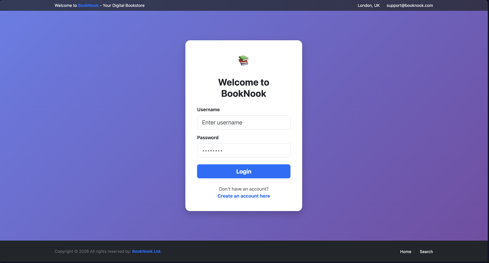

# 📚 BookNook - Online Bookstore Prototype

A Java-based E-commerce platform for book lovers. This project demonstrates a full-stack MVC architecture using Java Servlets, JSP, and MySQL.

### Getting Started
1. Import the `booknook_setup.sql` file into your database manager.
2. Update `DBUtil.java` with your local database credentials.
3. Deploy to Tomcat and enjoy!
4. 
## Features
* **User Authentication:** Secure login and registration.
* **Catalog Management:** Browse and search for books.
* **Shopping Cart:** Add/remove items with real-time subtotal calculation.
* **Order Processing:** Transactional checkout with stock validation.
* **Admin Dashboard:** Tools for managing books and users.

## Tech Stack
* **Backend:** Java (Jakarta Servlet API)
* **Frontend:** JSP, JSTL, Bootstrap 5, FontAwesome
* **Database:** MySQL 8.0
* **Server:** Apache Tomcat 10+
